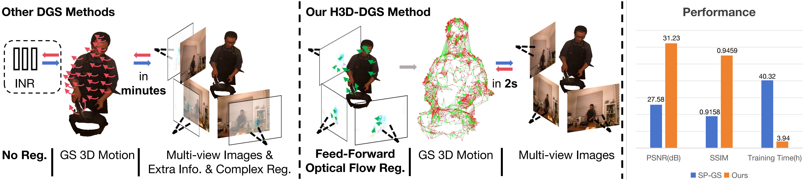
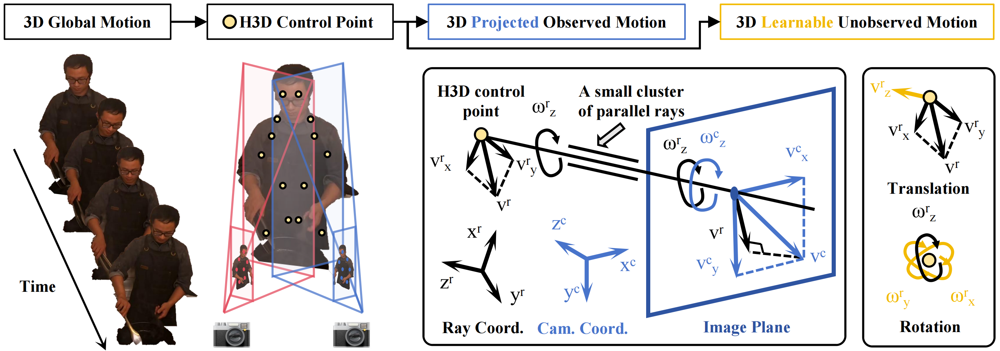
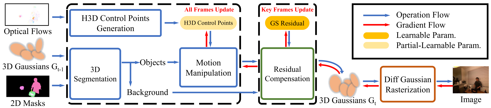

# H3D-DGS: Exploring Heterogeneous 3D Motion Representation for Deformable 3D Gaussian Splatting


## H3D Control Points

Brand-new motion discrete representation tailored for neural volume rendering. Marry neural representation with traditional graphics. H3D Control Points inherit 3D motion from 2D optical prior, thus effective constraint and fast convergence. No fear for complex motion.



## Streaming Pipeline

A straightforward but effective workflow enable **streaming** dynamic 3D reconstruction utilizing H3D points and 3D Gaussians. 




## Installation

assume that you have already installed nvcc version>=12.1,
or else you should follow the offical document to install CUDA driver as well as Nvidia toolkit.
https://docs.nvidia.com/cuda/cuda-installation-guide-linux/index.html


First clone this repository.
```
# Clone this repo(pytorch)
git clone https://github.com/hebing-sjtu/H3D-DGS.git --recursive
# or
git clone https://github.com/hebing-sjtu/H3D-DGS.git
git submodule update --init --recursive
```

Then install the dependence of this repo
```
# Install this repo
conda create -n h3d-dgs python=3.10 -y
conda activate h3d-dgs
conda install pytorch==2.5.0 torchvision==0.20.0 torchaudio==2.5.0 pytorch-cuda=12.1 -c pytorch -c nvidia -y
pip install -r requirements.txt
```

Compile the rasterization as well as knn
```
# Install rasterization
cd submodules/rasterization
python setup.py install
pip install .
cd ../..
# Install KNN with CUDA support
cd submodules/KNN
make && make install
cd ../..
```

Optionally compile the kmeans tool for control points prune
```
# Install KMeans with CUDA support(optional)
cd submodules/KMeans
python setup.py install
pip install .
cd ../..
```

## Data preparation
```python
datasets
    |
    |-Neural3D
    |    |
    |    |# sequences
    |    |-sear_steak
    |    |    |
    |    |    |# control pts on flow map
    |    |    |-flows
    |    |    |    |-*.pkl
    |    |    |
    |    |    |# multiview cameras
    |    |    |-imgs
    |    |    |    |# cam_id
    |    |    |    |-0
    |    |    |    |-1
    |    |    |    |-...
    |    |    |    |-20
    |    |    |
    |    |    |# masks with object_id.
    |    |    |# mask_00 refers to background mask.
    |    |    |-mask_00
    |    |    |    |# cam_id
    |    |    |    |-0
    |    |    |    |-1
    |    |    |    |-...
    |    |    |    |-20
    |    |    |-mask_01
    |    |    |-mask_02
    |    |    |-mask_03
    |    |    |
    |    |    |# initialized pc
    |    |    |-points3D_downsample2.ply
    |    |
    |    |-cook_spinach
    |    |-coffee_martini
    |
    |-CMU-Panoptic

```

